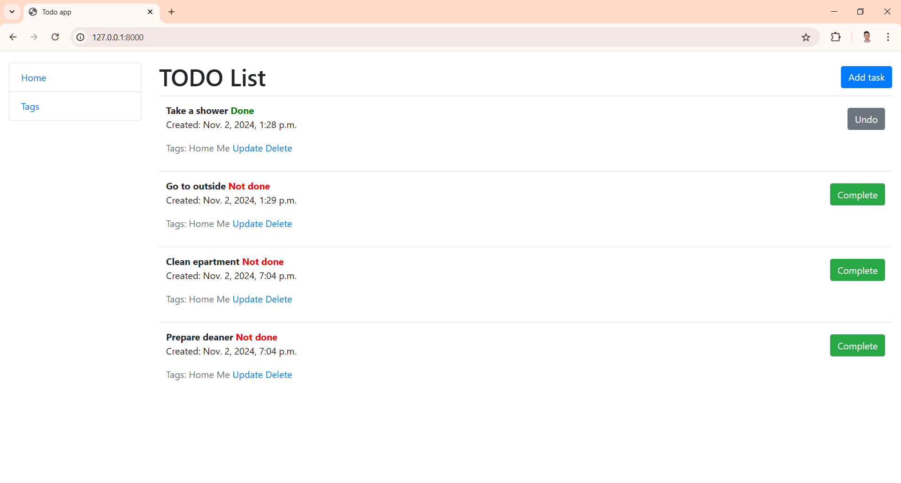
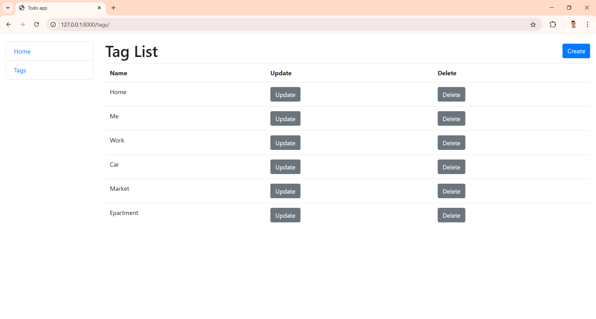

# Todo-list Project
Django project for managing daily simple tasks

## Installation

Python 3 must be already installed

```commandline
git clone https://github.com/MaksymProtsak/Todo-list.git
cd todo-list
python -m venv venv
venv\Scripts\activate
pip install -r requirements.txt
python manage.py runserver  # starts Django Server
```

## Features
* Managing tasks with unique task tags
* Task contain fields: 
  * content - description on task
  * datetime - auto created date, when task has been created
  * deadline - deadline of task
  * is_done - task status
  * tags - tags linked to the task. Tags should be created before creating task

## Demo


